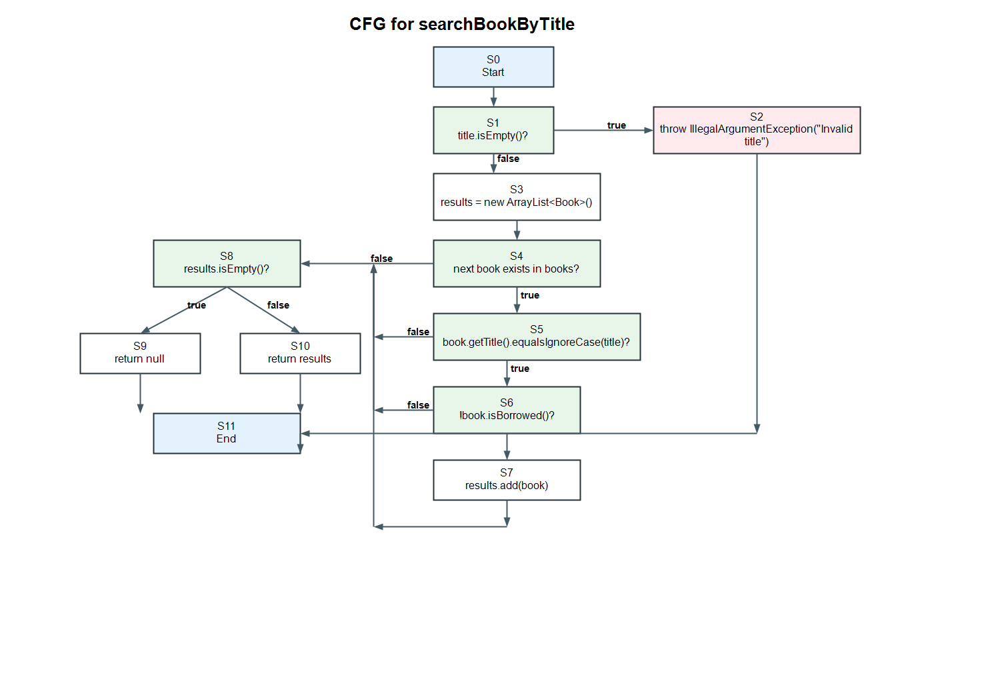
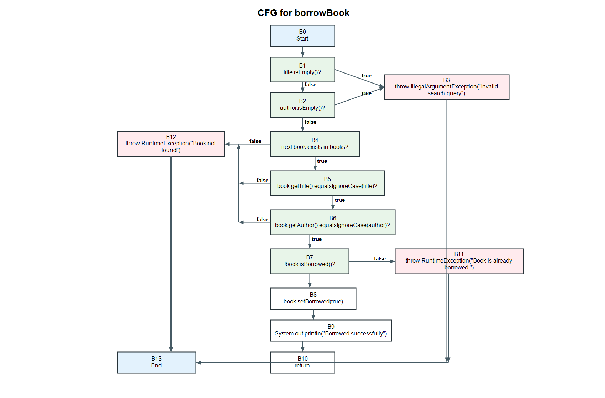

# SI 2026 Lab 2 - 222097

## Student

- Name and surname: Viktor Najdovski
- Index: 222097

## Assignment description

This project contains the solution for Software Engineering 2026 Lab 2. The analyzed functions are:

- `searchBookByTitle(String title)`
- `borrowBook(String title, String author)`

The project includes CFG diagrams, cyclomatic complexity calculations, and JUnit tests for the Every Statement, Every Branch, and Multiple Condition criteria.

## Control Flow Graphs

### CFG for `searchBookByTitle`



### CFG for `borrowBook`



## Cyclomatic complexity

The calculation uses short-circuit-expanded CFGs. That means compound conditions with `&&` and `||` are represented as separate predicate nodes, which matches Java's actual control flow.

### `searchBookByTitle`

Predicate nodes:

1. `title.isEmpty()`
2. loop condition: next book exists
3. `book.getTitle().equalsIgnoreCase(title)`
4. `!book.isBorrowed()`
5. `results.isEmpty()`

Formula:

```text
V(G) = P + 1 = 5 + 1 = 6
```

Cyclomatic complexity for `searchBookByTitle` is **6**.

### `borrowBook`

Predicate nodes:

1. `title.isEmpty()`
2. `author.isEmpty()`
3. loop condition: next book exists
4. `book.getTitle().equalsIgnoreCase(title)`
5. `book.getAuthor().equalsIgnoreCase(author)`
6. `!book.isBorrowed()`

Formula:

```text
V(G) = P + 1 = 6 + 1 = 7
```

Cyclomatic complexity for `borrowBook` is **7**.

## Every Statement criterion for `searchBookByTitle`

| Test case | Input/state | Expected result | Covered statements |
|---|---|---|---|
| ES1 | `title = ""` | Throws `IllegalArgumentException("Invalid title")` | validation if, exception statement |
| ES2 | available book with title `Clean Code` exists | Returns list with that book | result list creation, loop, successful condition, `results.add(book)`, `return results` |
| ES3 | no book with title `Harry Potter` exists | Returns `null` | loop traversal, empty result check, `return null` |

Minimum number of test cases for Every Statement: **3**.

Implemented in:

```java
searchBookEveryStatementTest()
```

## Every Branch criterion for `borrowBook`

| Test case | Input/state | Expected result | Covered branches |
|---|---|---|---|
| EB1 | empty title | Throws `IllegalArgumentException("Invalid search query")` | validation true branch |
| EB2 | matching available book | Book becomes borrowed | validation false, match true, not-borrowed true |
| EB3 | matching already borrowed book | Throws `RuntimeException("Book is already borrowed.")` | match true, not-borrowed false |
| EB4 | no matching title/author | Throws `RuntimeException("Book not found")` | match false, loop exit/not-found branch |

Minimum number of test cases for Every Branch: **4**.

Implemented in:

```java
borrowBookEveryBranchTest()
```

## Multiple Condition criterion

### `borrowBook`: `title.isEmpty() || author.isEmpty()`

Let:

- A = `title.isEmpty()`
- B = `author.isEmpty()`

| Test case | A | B | Input | Expected result |
|---|---|---|---|---|
| MC-B1 | T | T | `borrowBook("", "")` | Throws `IllegalArgumentException` |
| MC-B2 | T | F | `borrowBook("", "Robert C. Martin")` | Throws `IllegalArgumentException` |
| MC-B3 | F | T | `borrowBook("Clean Code", "")` | Throws `IllegalArgumentException` |
| MC-B4 | F | F | `borrowBook("Clean Code", "Robert C. Martin")` | Book is borrowed successfully |

Minimum number of test cases for this condition: **4**.

Implemented in:

```java
borrowBookMultipleConditionTest()
```

### `searchBookByTitle`: `book.getTitle().equalsIgnoreCase(title) && !book.isBorrowed()`

Let:

- A = `book.getTitle().equalsIgnoreCase(title)`
- B = `!book.isBorrowed()`

| Test case | A | B | Input/state | Expected result |
|---|---|---|---|---|
| MC-S1 | T | T | matching available book | Book is returned in result list |
| MC-S2 | T | F | matching borrowed book | Returns `null` |
| MC-S3 | F | T | non-matching available book | Returns `null` |
| MC-S4 | F | F | non-matching borrowed book | Returns `null` |

Minimum number of test cases for this condition: **4**.

Implemented in:

```java
searchBookMultipleConditionTest()
```

## How to run

```bash
./gradlew test
```

On Windows:

```bash
gradlew.bat test
```
